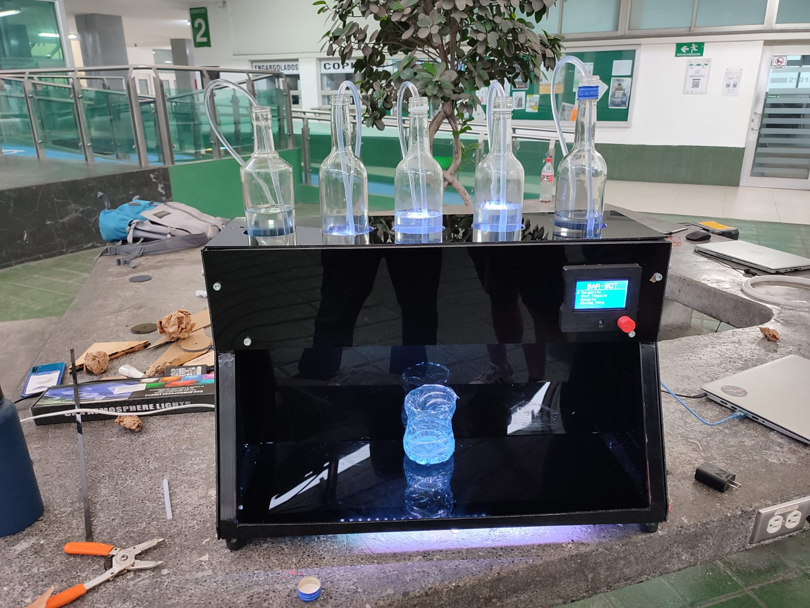

# Bar-bot
Bar automatico para la materia de Diseño de Sistemas Mecatrónicos

Proyecto hecho en PlatformIO

## Tutoriales
- [¿Como agregar librerias?](https://www.youtube.com/watch?v=sDczUDt8ieo)
- [Documentacion de libreria U8g2](https://github.com/olikraus/u8g2/wiki/u8g2reference#drawstr)
- [Tipos de letra](https://github.com/olikraus/u8g2/wiki/fntlist8)